# Project: Perception Pick & Place

---

### Required Steps for a Passing Submission
1. Extract features and train an SVM model on new objects (see `pick_list_*.yaml` in `/pr2_robot/config/` for the list of models you'll be trying to identify).
2. Write a ROS node and subscribe to `/pr2/world/points` topic. This topic contains noisy point cloud data that you must work with.
3. Use filtering and RANSAC plane fitting to isolate the objects of interest from the rest of the scene.
4. Apply Euclidean clustering to create separate clusters for individual items.
5. Perform object recognition on these objects and assign them labels (markers in RViz).
6. Calculate the centroid (average in x, y and z) of the set of points belonging to that each object.
7. Create ROS messages containing the details of each object (name, pick_pose, etc.) and write these messages out to `.yaml` files, one for each of the 3 scenarios (`test1-3.world` in `/pr2_robot/worlds/`).  [See the example `output.yaml` for details on what the output should look like.](https://github.com/udacity/RoboND-Perception-Project/blob/master/pr2_robot/config/output.yaml)  
8. Submit a link to your GitHub repo for the project or the Python code for your perception pipeline and your output `.yaml` files (3 `.yaml` files, one for each test world).  You must have correctly identified 100% of objects from `pick_list_1.yaml` for `test1.world`, 80% of items from `pick_list_2.yaml` for `test2.world`, and 75% of items from `pick_list_3.yaml` in `test3.world`.
9. Congratulations!  You're done!

### Extra Challenges - Complete the Pick & Place
1. To create a collision map, publish a point cloud to the `/pr2/3d_map/points` topic and make sure you change the `point_cloud_topic` to `/pr2/3d_map/points` in `sensors.yaml` in the `/pr2_robot/config/` directory. This topic is read by Moveit!, which uses this point cloud input to generate a collision map, allowing the robot to plan its trajectory.  Keep in mind that later when you go to pick up an object, you must first remove it from this point cloud so it is removed from the collision map!
2. Rotate the robot to generate collision map of table sides. This can be accomplished by publishing joint angle value (in radians) to `/pr2/world_joint_controller/command`
3. Rotate the robot back to its original state.
4. Create a ROS Client for the “pick_place_routine” rosservice.  In the required steps above, you already created the messages you need to use this service. Checkout the [PickPlace.srv](https://github.com/udacity/RoboND-Perception-Project/tree/master/pr2_robot/srv) file to find out what arguments you must pass to this service.
5. If everything was done correctly, when you pass the appropriate messages to the `pick_place_routine` service, the selected arm will perform pick and place operation and display the trajectory in the RViz window.
6. Place all the objects from your pick list in their respective dropoff boxes, and you have completed the challenge!
7. Looking for a bigger challenge?  Load up the `challenge.world` scenario and see if you can get your perception pipeline working there!

## [Rubric](https://review.udacity.com/#!/rubrics/1067/view) Points
#### Here I will consider the rubric points individually and describe how I addressed each point in my implementation.
---
### Writeup / README
#### 1. Provide a Writeup / README that includes all the rubric points and how you addressed each one.  You can submit your writeup as markdown or pdf.  
You're reading it!

### Exercise 1, 2 and 3 pipeline implemented
#### 1. Complete Exercise 1 steps. Pipeline for filtering and RANSAC plane fitting implemented.
All the perception code for this project can be found in `perception_pipeline.py`, which is located at `./pr2_robot/scripts`. Within this script, to more conveniently handle the incoming and outgoing data, I created a `Robot()` class, which holds the data and contains the methods necessary to handle the data. The `Robot()` class starts the ROS node and necessary publishers/subscribers in its `__init__()` method. Also, instead of using a single callback function `pcl_callback()` to handle all the perception tasks at one time, I changed `pcl_callback()` into `make_decision()`, which chooses different methods to run depending on which task needs to be done (object detection, robot rotation, yaml output, etc.). Exercise 1 steps can be found in the method `detect_objects()`. It first applies a statistical outlier filter, a Voxel Grid downsampling filter, and a couple of passthrough filters to the incoming camera data, as shown below:

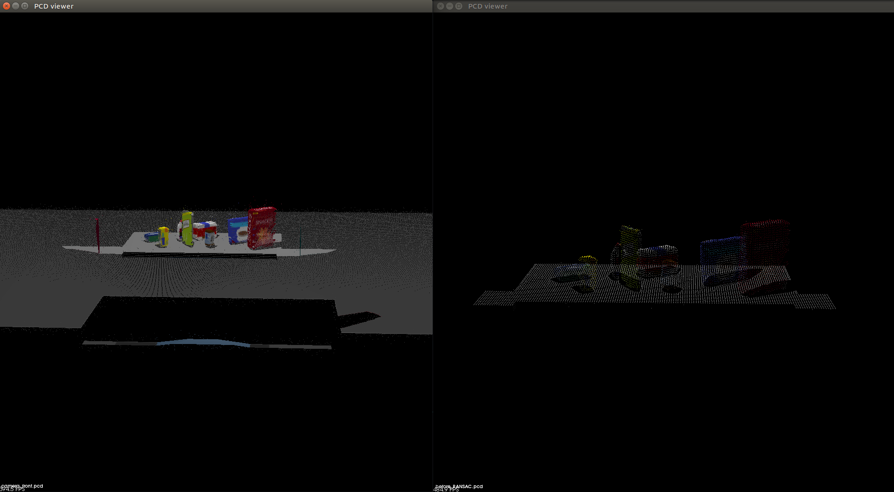

Then it applies the RANSAC plane fitting algorithm to separate the table from the objects, as shown below:
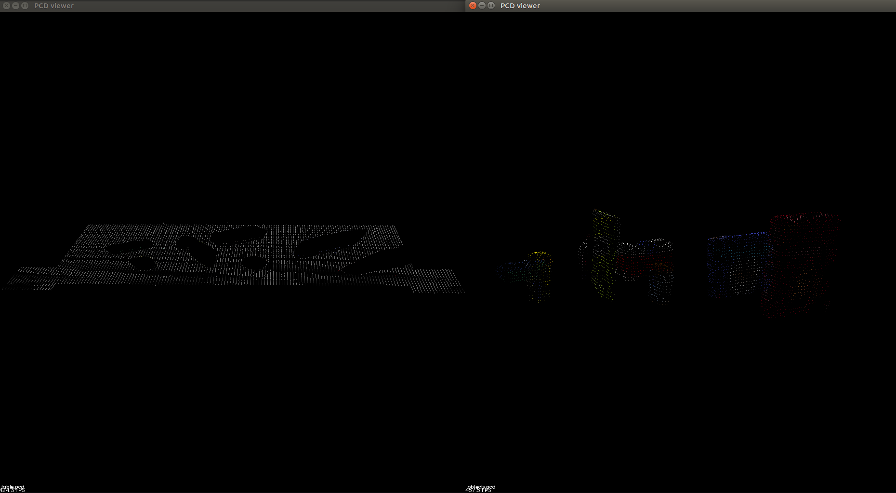

#### 2. Complete Exercise 2 steps: Pipeline including clustering for segmentation implemented.
Cluster segmentation is also implemented in the `detect_objects()` method, after the RANSAC plane fitting. A Euclidean clustering algorithm is applied to the objects. The figure below shows the clustered objects, each with their own color.

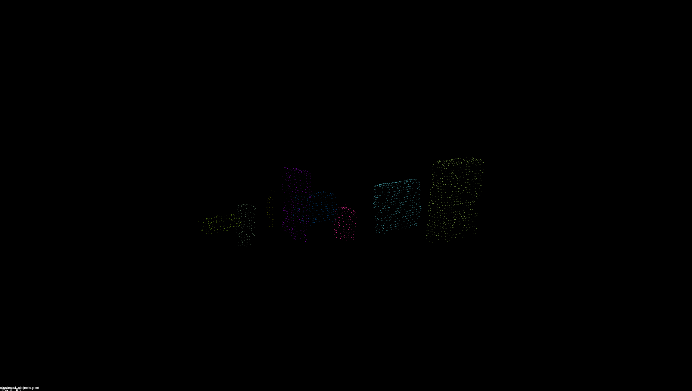

#### 3. Complete Exercise 3 Steps.  Features extracted and SVM trained.  Object recognition implemented.
Feature extraction was done using the `compute_color_histograms()` and `compute_normal_histograms()` functions, which compute histograms using HSV color values and x, y, z normals of the points in a given cluster cloud. While they are a part of the `sensor_stick` module, the reference code can be found at `./reference/features.py`. Training data was gathered using the `capture_features.py` script from the `sensor_stick` module. This training data was then used to train a SVM using `train_svm.py`. The pickle files for the training data (`training_set.sav`) and saved classifier (`model.sav`) can be found at `./pr2_robot/scripts/svm_data`. The normalized confusion matrix output from `train_svm.py` is shown below. The code for classifying objects can be found in the `detect_objects()` method, after cluster segmentation. The resulting labels and clouds are then stored as an instance attribute (`self.detected_objects`).

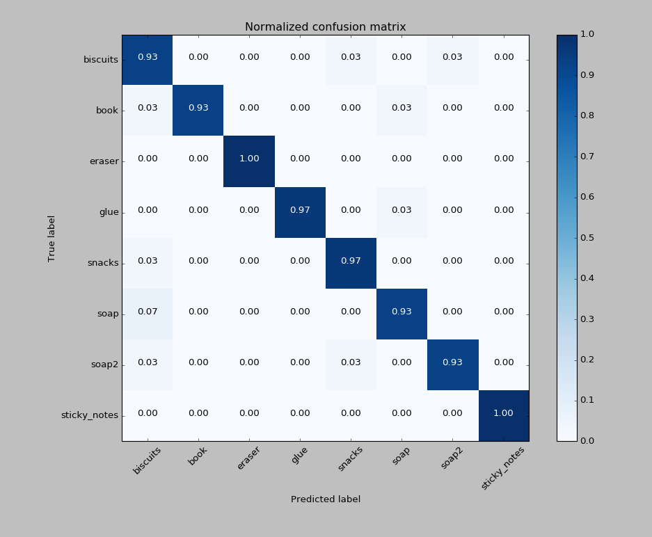

### Pick and Place Setup
#### 1. For all three tabletop setups (`test*.world`), perform object recognition, then read in the respective pick list (`pick_list_*.yaml`). Next, construct the messages that would comprise a valid `PickPlace` request and output them to `.yaml` format.
The object recognition portion of the code is located in the `detect_objects()` method and was discussed above. After object recognition is carried out, the `create_pick_list()` method prepares the `output.yaml` file using the labeled clouds and data from the pick list. The `output.yaml` files for the first three test worlds as well as the challenge world can be found in `./yaml_output`. Screenshots showing the objects along with their corresponding label markers can be seen below for the first three test worlds (NOTE: robot model has been turned off for better object view).

**Test1.world**
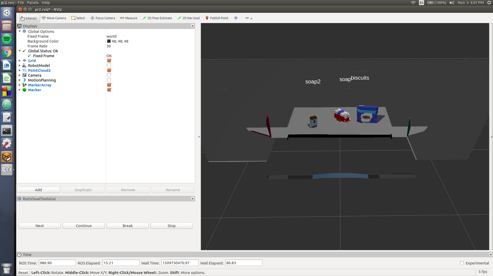

**Test2.world**
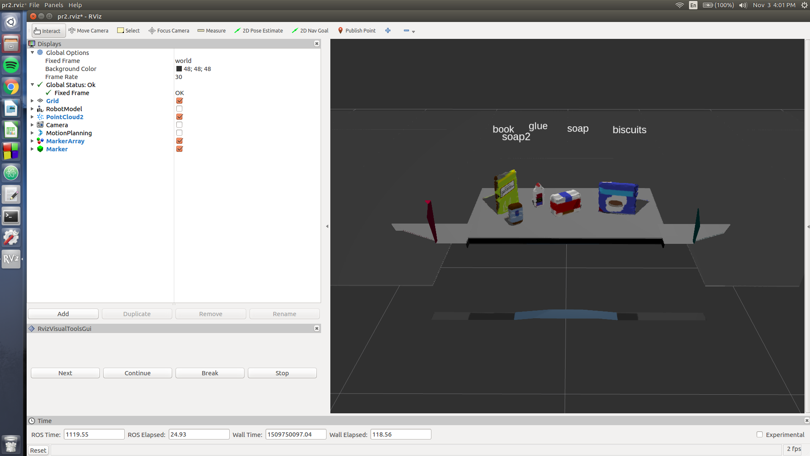

**Test3.world**
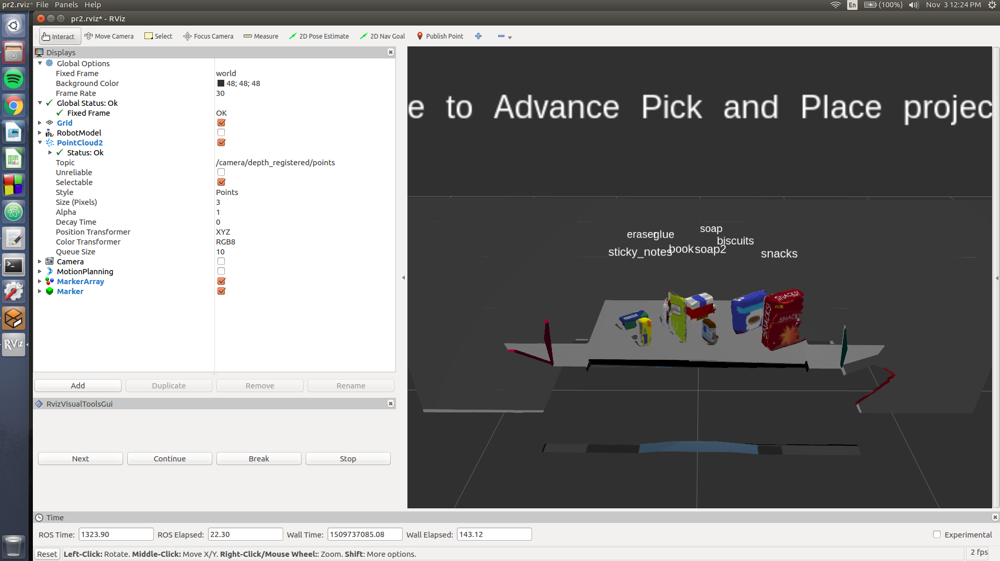

### Extra Challenges
#### 1. Complete Pick-and-Place
After generating the `output.yaml`, the code continues by first rotating the robot right 90 degrees. At this point, the `update_collision_map()` method takes the camera point cloud, filters it, and combines it with the front table point cloud, which was obtained by RANSAC segmentation in the `detect_objects()` method. This collision map is stored in the `self.collision_map` instance attribute. The robot then rotates to its left and repeats the process. The end result is a combined collision map that includes the table in front and on the sides, along with the two dropboxes on the right and on the left. After the robot rotates back to the middle, the `publish_collision_map()` method is called. At this point, if an old octomap exists, it is cleared by calling the `/clear_octomap` service. Then the method iterates through the pick list, starting after the current object through to the end of the pick list, adding each object cloud to the collision map. Then the finished collision map is published to the topic `/pr2/3d_map/points`. After the collision map is published, the method `pr2_mover()` is called. `pr2_mover()` takes in the information needed to complete the pick-and-place of the current object and calls the `pick_place_routine` service. Once the pick-and-place is complete, the process repeats with the next object, starting from `publish_collision_map(),` until all the objects are in the dropboxes.

The image below shows the robot rotating to capture point cloud data from one of its sides to incorporate into the collision map.
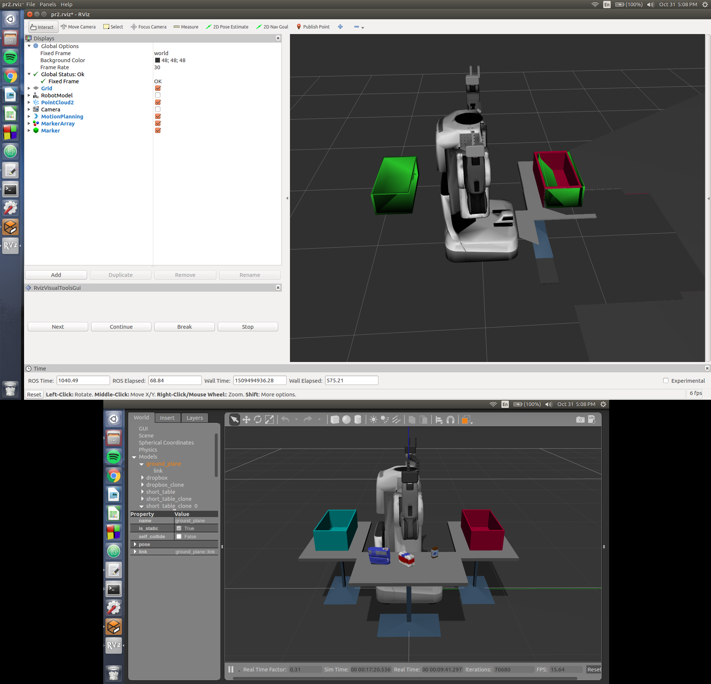

The image below shows the collision map just prior to picking the first object. Note how the first object (biscuits) is not included in the collision map, whereas the other objects (soap and soap2) are included.
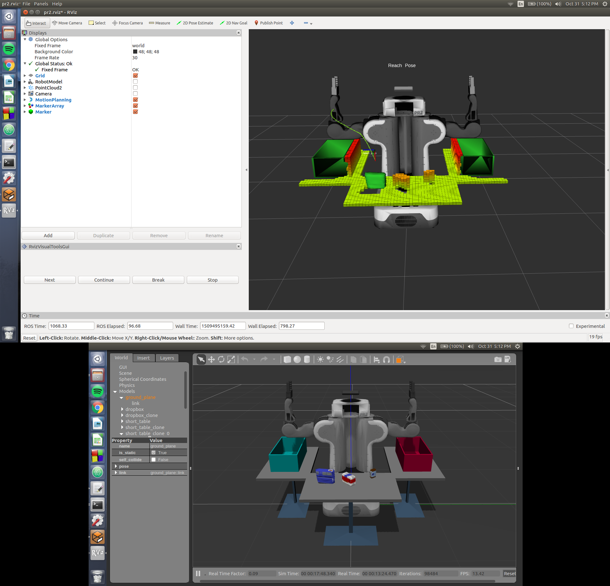

The image below shows the robot successfully placing the first object (biscuits) into the green dropbox.
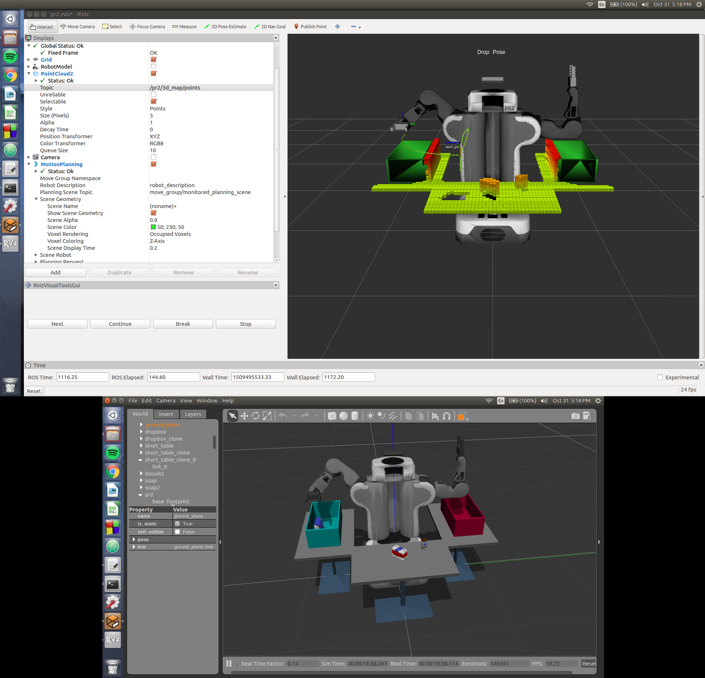

The image below shows the robot preparing to pick the second object (soap). Note the updated collision map. The second object (soap) is no longer included as part of the collision map, while the third object (soap2) remains a part of the collision map.
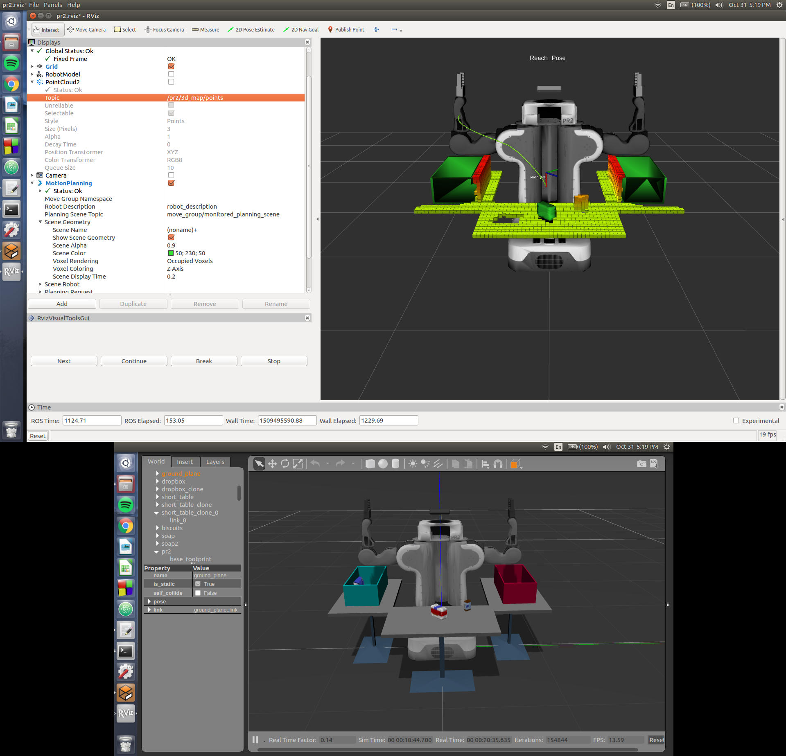

#### 2. Challenge World
Because the challenge world objects are located on both sides of the robot, I created another script called `perception_pipeline_challenge.py`, which is also located in `./pr2_robot/scripts`. This script is nearly identical to `perception_pipeline.py`, but contains modifications to the order of robot operations. It first rotates left and right, saving the scene in front and on the sides using the `update_scene()` method. This method also uses a number of passthrough filters to isolate the eight objects in the scene (which are saved in the `self.objects` instance attribute). The scene is then published to `/pr2/3d_map/points` using the `publish_scene()` method. Object recognition is performed on the isolated objects using the `detect_objects()` method. Finally, the `.yaml` pick list is created. The challenge world pick list can be found in `./yaml_output` as `output_4.yaml`.

The image below shows the correctly labeled objects in the challenge world (with robot model removed for better object view).
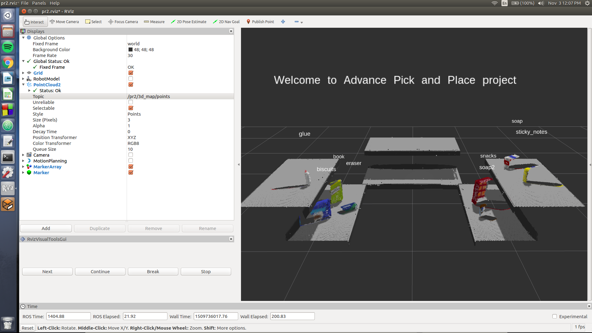

### Further Discussion
#### Spend some time at the end to discuss your code, what techniques you used, what worked and why, where the implementation might fail and how you might improve it if you were going to pursue this project further.

The structure of code outlined in the `project_template.py` had the entire perception pipeline located within one function `pcl_callback()`. This resulted in difficulty obtaining camera data from the right and left sides of the robot since the code would still be in the middle of the callback function for the previous point cloud from front of the robot. To resolve this, I changed `pcl_callback()` into `make_decision()`, which uses robot states to determine which other data handling functions to call. This allowed the callback function to return after the necessary data handling tasks were completed for a given camera point cloud. The callback function can then take in a new point cloud, if needed. Furthermore, to facilitate data storage between functions, I created the `Robot()` class, which stores persistent data in instance attributes, which then can be accessed by class methods. Additionally, in `perception_pipeline_challenge.py`, I added a `Cloud()` class to store point cloud data with all the different filtering functions as class methods. This affords for more readable code.

If I were to pursue this project further, I would probably add pick-and-place destinations for the challenge world objects (perhaps the front table) and have the robot perform pick-and-place operations on the challenge world objects.
